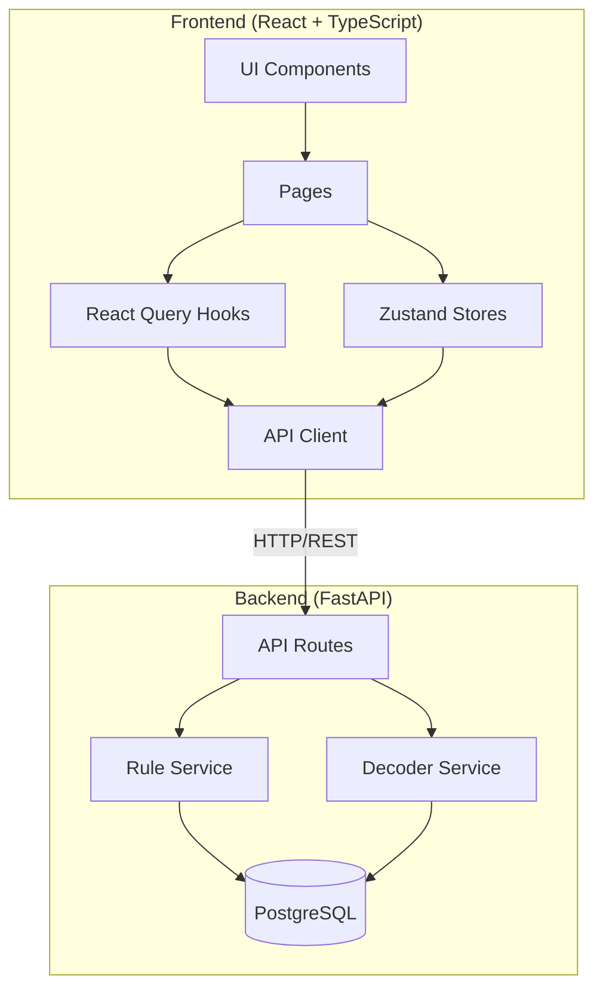
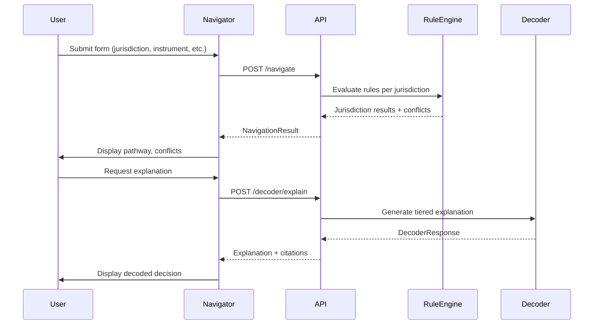

# Compliance Navigator

Cross-border DeFi regulatory compliance navigator. Analyze multi-jurisdiction token offerings across EU (MiCA), UK (FCA), US (SEC), Switzerland (FINMA), and Singapore (MAS) frameworks.


## Features

- **Multi-Jurisdiction Analysis** - Evaluate compliance across 5 major regulatory frameworks
- **Compliance Pathway** - Step-by-step roadmap with timelines and dependencies
- **Conflict Detection** - Identify and resolve cross-border regulatory conflicts
- **What-If Analysis** - Counterfactual scenarios for jurisdiction/entity changes
- **Decision Decoder** - Tiered explanations (retail, protocol, institutional, regulator)
- **Contextual Help** - Tooltips and inline guidance for regulatory concepts
- **Action-Oriented Results** - NextSteps card with prioritized actions
- **Decision Tree Engine** - Clojure-inspired pure functional rule evaluation with trace generation

## Architecture



## Data Flow



## Tech Stack

| Layer | Technology |
|-------|------------|
| Framework | React 18 + TypeScript |
| Build | Vite 5 |
| Styling | Tailwind CSS |
| State | Zustand |
| Server State | TanStack React Query |
| HTTP Client | Axios |
| Validation | Zod |
| CI/CD | GitHub Actions + Vercel |

## Getting Started

### Prerequisites

- Node.js 18+
- npm or pnpm
- Backend running at `localhost:8000` (see [regulatory-ke-workbench](https://github.com/YOUR_USERNAME/regulatory-ke-workbench))

### Installation

```bash
# Clone the repository
git clone https://github.com/YOUR_USERNAME/compliance-navigator.git
cd compliance-navigator

# Install dependencies
npm install

# Copy environment variables
cp .env.example .env

# Start development server
npm run dev
```

Open [http://localhost:5173](http://localhost:5173) in your browser.

## Project Structure

```
src/
├── api/                 # API client layer
│   ├── client.ts        # Axios configuration
│   ├── navigate.ts      # Navigation endpoints
│   ├── decoder.ts       # Decoder endpoints
│   └── counterfactual.ts
│
├── components/
│   ├── forms/           # Input components
│   ├── layout/          # Header, ViewTabs, Footer
│   ├── results/         # ResultsSummary, NextStepsCard, QuickStats
│   ├── pathway/         # PathwayTimeline, PathwayStep
│   ├── conflicts/       # ConflictsList, ConflictCard
│   └── shared/          # Button, Card, Badge, Tooltip, HelpIcon
│
├── lib/
│   └── decisionTree/    # Clojure-inspired decision engine
│       ├── evaluator.ts # Pure evaluation functions (getIn, evaluateTree)
│       └── conflicts.ts # Cross-jurisdiction conflict detection
│
├── rules/               # JSON rule definitions
│   └── mica-stablecoin.json
│
├── hooks/               # React Query mutations
├── pages/               # Route pages
├── stores/              # Zustand state management
├── types/               # TypeScript definitions (including decisionTree.ts)
├── constants/
│   ├── help/            # Contextual help content
│   ├── jurisdictions.ts
│   └── instruments.ts
└── utils/               # Formatters, classNames
```

## Available Scripts

| Command | Description |
|---------|-------------|
| `npm run dev` | Start development server |
| `npm run build` | Build for production |
| `npm run preview` | Preview production build |
| `npm run lint` | Run ESLint |
| `npm run typecheck` | Run TypeScript check |

## Environment Variables

| Variable | Description | Default |
|----------|-------------|---------|
| `VITE_API_URL` | Backend API URL | `http://localhost:8000` |
| `VITE_DEBUG` | Enable debug mode | `false` |

## Supported Jurisdictions

| Code | Jurisdiction | Authority | Framework |
|------|--------------|-----------|-----------|
| EU | European Union | ESMA | MiCA 2023 |
| UK | United Kingdom | FCA | FCA Crypto 2024 |
| US | United States | SEC/CFTC | Securities Act 1933 |
| CH | Switzerland | FINMA | FINSA/DLT 2021 |
| SG | Singapore | MAS | PSA 2019 |

## Deployment

### Vercel (Recommended)

[](https://vercel.com/new/clone?repository-url=https://github.com/YOUR_USERNAME/compliance-navigator)

### Manual

```bash
npm run build
# Deploy `dist/` folder to any static host
```

## Decision Tree Engine

The frontend includes a Clojure-inspired decision tree engine for client-side rule evaluation:

```typescript
import { evaluateTree, getIn } from '@/lib/decisionTree';
import { MICA_STABLECOIN_RULE } from '@/rules';

const facts = {
  instrument: { type: 'stablecoin', reference_asset: 'fiat_single', reserve_value_eur: 1000000 },
  issuer: { type: 'credit_institution' }
};

const { leaf, trace } = evaluateTree(MICA_STABLECOIN_RULE.tree, facts);
// leaf.decision: "EMT by authorized institution: Notification and whitepaper required"
// trace: Array of evaluated conditions with source citations
```

**Key Features:**
- Pure functions (no side effects)
- Full evaluation trace for audit trails
- Clojure-style operators (`eq`, `neq`, `gt`, `in`, `nil?`, `some?`)
- Partial evaluation for incomplete facts

## API Integration

This frontend connects to the [regulatory-ke-workbench](https://github.com/YOUR_USERNAME/regulatory-ke-workbench) FastAPI backend.

### Key Endpoints

| Endpoint | Method | Description |
|----------|--------|-------------|
| `/navigate` | POST | Cross-border compliance analysis |
| `/decoder/explain/inline` | POST | Generate tiered explanations |
| `/counterfactual/analyze/inline` | POST | What-if scenario analysis |

## Contributing

1. Fork the repository
2. Create a feature branch (`git checkout -b feature/add-feature`)
3. Commit changes (`git commit -m 'Add feature'`)
4. Push to branch (`git push origin feature/add-feature`)
5. Open a Pull Request

## License

MIT

---

**Disclaimer:** This is a research/demo project. Not legal advice. Consult qualified counsel for regulatory compliance matters.
