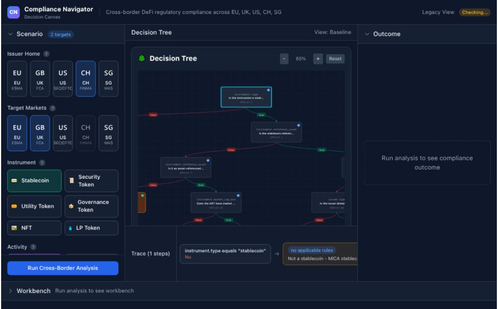
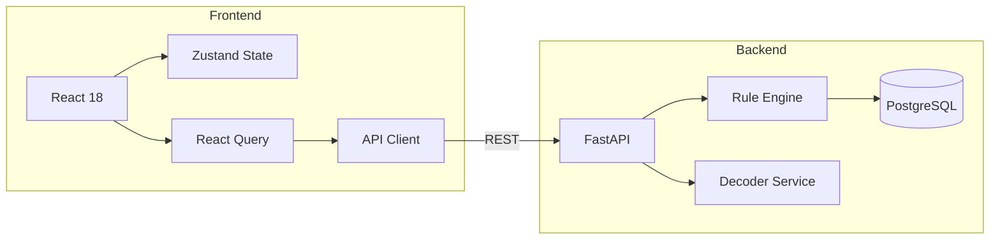
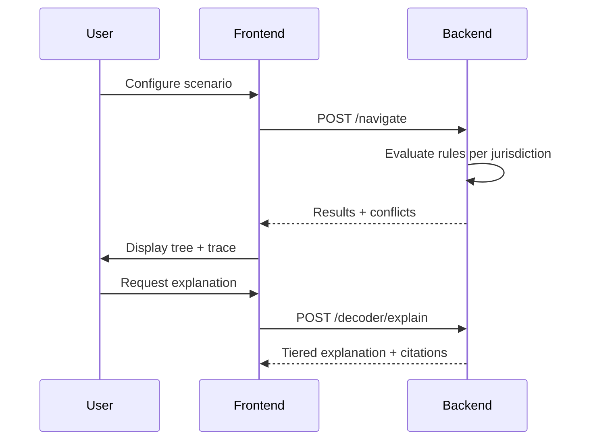

# Compliance Navigator

> Cross-border DeFi regulatory compliance analysis across EU (MiCA), UK, US, Switzerland, and Singapore.

**[Live Demo](https://defi-compliance-navigator.vercel.app)** | [Backend Repo](https://github.com/hossainpazooki/regulatory-ke-workbench)


## Overview

[](https://defi-compliance-navigator.vercel.app)

## Features

- **Multi-Jurisdiction Analysis** — Evaluate 5 regulatory frameworks simultaneously
- **Decision Tree Visualization** — Interactive SVG with pan/zoom, path highlighting
- **Trace Explorer** — Step-by-step evaluation audit trail with citations
- **Decision Decoder** — AI explanations anchored to canonical rule outcomes
- **What-If Analysis** — Counterfactual scenarios with diff overlay

## Architecture



## Data Flow



## Quick Start

```bash
git clone https://github.com/hossainpazooki/defi-compliance-navigator.git
cd defi-compliance-navigator
npm install
npm run dev
```

Open [localhost:5173](http://localhost:5173). Works in demo mode without backend.

## Tech Stack

| Layer | Tech |
|-------|------|
| UI | React 18 + TypeScript |
| State | Zustand + React Query |
| Styling | Tailwind CSS |
| Visualization | Custom SVG (Reingold-Tilford) |
| Build | Vite 5 |

## Project Structure

```
src/
├── components/
│   ├── canvas/          # 3-panel workspace (Left/Center/Right Rail)
│   ├── decision-tree/   # SVG tree viewer + nodes + edges
│   └── trace-explorer/  # Evaluation trace display
├── lib/
│   ├── decisionTree/    # Pure functional rule evaluator
│   └── svg/             # Tree layout algorithm
├── rules/               # JSON rule definitions
├── hooks/               # Canvas state, tree highlighting
├── stores/              # Zustand stores
└── types/               # TypeScript definitions
```

## Decision Engine

Client-side Clojure-inspired rule evaluation:

```typescript
import { evaluateTree } from '@/lib/decisionTree';
import { MICA_STABLECOIN_RULE } from '@/rules';

const facts = {
  instrument: { type: 'stablecoin', reserve_value_eur: 1000000 },
  issuer: { type: 'credit_institution' }
};

const { leaf, trace } = evaluateTree(MICA_STABLECOIN_RULE.tree, facts);
// leaf.decision: "EMT by authorized institution: Notification required"
// trace: [{nodeId, condition, result, sourceRef}, ...]
```

**Node Types:**
- `ConditionNode` — Binary decision (true/false branches)
- `LeafNode` — Terminal outcome with obligations
- `GroupNode` — Collapsible jurisdiction module
- `RouterNode` — Parallel dispatch to subtrees

## Jurisdictions

| Code | Region | Authority | Framework |
|------|--------|-----------|-----------|
| EU | European Union | ESMA | MiCA 2023 |
| UK | United Kingdom | FCA | Crypto 2024 |
| US | United States | SEC/CFTC | Securities Act |
| CH | Switzerland | FINMA | DLT 2021 |
| SG | Singapore | MAS | PSA 2019 |

## Scripts

```bash
npm run dev        # Development server
npm run build      # Production build
npm run typecheck  # TypeScript check
npm run lint       # ESLint
```

## Environment

| Variable | Default |
|----------|---------|
| `VITE_API_URL` | `http://localhost:8000` |

## License

MIT

---

*Research project. Not legal advice.*
